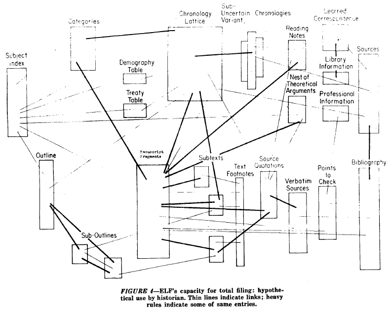

# Subtext: markup for note-taking

Subtext is a text-based, block-oriented hypertext format. It is designed with note-taking in mind. It has a simple, people-friendly syntax with a passing resemblance to Markdown.

**See the [Speculative Specification](specification.md)**.

We're experimenting with Subtext as part of [Subconscious](https://subconscious.substack.com/), a new tool for thought.

**Warning to implementors**: Subtext is currently experimental status.  We'll be spending some time living with Subtext and building experimental tools on top of it before committing to anything. The language design is just a hypothesis! It might undergo radical breaking changes! This is work in progress, and shared in the spirit of working with the garage door open.

## A bit of Subtext

Here’s an example:

```
# Heading

Plain text

- List item
- List item

> Quoted text

& example.csv
& https://example.com
```

**Subtext is line-oriented**. Each line in the file is treated as a discrete block of content. The type of a line is determined by a sigil character, like `#`, `&`, `>`, at the front of the line. If a line doesn’t have a sigil character, it is treated as plain text. This makes Subtext very easy to parse, and very easy to write. It is currently impossible to write broken Subtext, which is nice!

## Subtext is for notes

> Today the book is already… an outdated mediation between two different filing systems. For everything that matters is to be found in the card box of the researcher who wrote it, and the scholar studying it assimilates it into his own card index. (Walter Benjamin)

HTML comes in web pages. The analogy for an HTML document is quite literally _a page_. The image that springs to mind is of an 8.5x11” sheet, carefully typeset, with multiple fonts, headings, complex formatting, perhaps laid out across many columns. HTML is a publication format, designed to produce complete, indivisible artifacts, called _pages_.

The right mental analogy for Subtext is not the page. It is the the [index card](https://subconscious.substack.com/p/thought-legos).

Subtext deliberately avoids the kind of complex presentation features offered by publishing formats like HTML, PDF, and LaTex. It has no opinions about fonts, colors, sizes.

Like a stack of index cards, there are many ways to use Subtext, beyond simple linear layout. It isn’t just for narrative. It’s [hypertext montage](https://subconscious.substack.com/p/hypertext-montage).

## Subtext is block-oriented

Subtext represents _block-oriented documents_ as _line-oriented markup_.

A block-oriented document is made up of a list of blocks of different types (or occasionally, a tree of blocks). Each block type may be displayed differently. For example, a quote block may render as quote-formatted text, while an image block may render an image in-place.

Some of the earliest hypertext proposals were block-oriented, including Ted Nelson's ELF (Nelson, 1965). Block-oriented documents have also independently evolved within many contemporary tools-for-thought, including [Notion](https://www.notion.so/), [Roam](https://roamresearch.com/), and [Ward Cunningham's Federated Wiki](http://fed.wiki.org/view/federated-wiki).

Why does this pattern keep re-emerging? One reason might be that block-oriented editing is an easy way to express rich formatting. But more importantly…

## Blocks are composable

Blocks are [thought legos](https://subconscious.substack.com/p/thought-legos). A block-oriented document is composable (and decomposable). You can break it apart into component blocks, filter it down to blocks of a particular type, merge documents, pluck out blocks, link to specific blocks, etc.

In theory, this is true of any tree-based markup language, such as HTML. But try meaningfully merging two HTML files in practice... Yikes! Tag soup!

A linear block-oriented format resolves the problem by radically simplifying it. With a linear data model, the range of meaningful document structures is narrowed, and this means you can make complex, yet meaningful programmatic decisions, without much context about the specific document:

- Excerpt a document by taking the first text block
- Select all quotes from a collection of documents
- Select all links, and generate a link graph for a collection of documents
- Find all backlinks and append them to the document as links

Linear block-oriented documents are like shipping containers for discrete thoughts. Because blocks are structurally uniform, they can be automatically moved around and reorganized. Software can split, join, and merge documents easily and effectively, because the document structure is simple.

## Subtext is hypertext

Link blocks (`&`) are the most important feature in Subtext. They let you reference other files, and URLs. You can link to any kind of file, including other Subtext files!

The plan is to have Subconscious display these links as [transclusions](https://en.wikipedia.org/wiki/Transclusion). Rather than linked words in text, imagine something more like a [quote tweet](https://indieweb.org/quote_tweet)… Links to images display as literal images, links to videos display as playable videos with playback controls, links to documents display some or all of the content inside of the linked document. This lets you compose hypertext documents from many smaller documents.

This keeps Subtext simple. Rather than extending the syntax of Subtext to include a complex feature like tables, we might, for example, link to a .csv file, which then gets rendered as a table. This also means the data stays in its native file type, and can be used in other applications.

## One of the many attempts of nature to evolve a Xanadu

By an accident of convergent evolution, Subtext haveappens to have some similarities to Ted Nelson's ELF format (Nelson, 1965).



Like ELF, Subtext documents are made up of a list of small blocks. Also like ELF, links are transcluded. Big documents can be composed by linking to small documents.

I discovered Ted Nelson’s ELF paper after writing up my first draft of Subtext. Uncovering this bit of convergent evolution was encouraging! It suggests I’m pulling on a worthwhile thread. [Xanadu](https://en.wikipedia.org/wiki/Ted_Nelson#Project_Xanadu) by way of [Markdown](https://daringfireball.net/projects/markdown/)? Something like that.

## Why not Markdown?

I took a deep breath before thinking about the jump from [Markdown](https://daringfireball.net/projects/markdown/). If you’re a programmer, Markdown is a de-facto standard for formatted text. For many, it is the first obvious choice for this kind of thing. So why Subtext?

Subtext has evolved out personal experiments with plain-text note-taking, spanning 10 years and 12k notes. Many of these notes are written in Markdown. However, over time, I noticed that my markup needs for note-taking were different from my markup needs for publishing. My note-taking style organically converged on a tiny subset of Markdown's features: text, links, lists, quotes, and one level of heading. To have more may be useful for publishing, but is often overkill for note-taking.

At the same time, I began to write small generative programs that worked with this collection of notes, little scripts that would combine ideas, remix notes, algorithmically generate new notes… these were the seeds that would later become Subconscious.

Here, I started to run into limitations with Markdown and HTML. As a complex publishing format, it is unclear how to meaningfully decompose or merge Markdown/HTML documents. When you combine documents, heading levels may need to be changed, lists may need to be flattened or nested. Because the document format is complex, foreknowledge of the meaning of the document is necessary to make meaningful changes. That limits what you can do with software.

Subtext is an attempt to resolve the problem by radically simplifying it. Paradoxically, by limiting the format to a flat list of blocks, we radically expand what software can usefully do with it. Blocks are easy to parse, easy to work with, and you can do all sorts of interesting generative algorithmic things with them.

The syntax is also simple, and hard to mess up, and I’m happy about that, too.

## Project links

- [Specification](specification.md)
- [FAQ](faq.md)
- [Design principles](design.md)